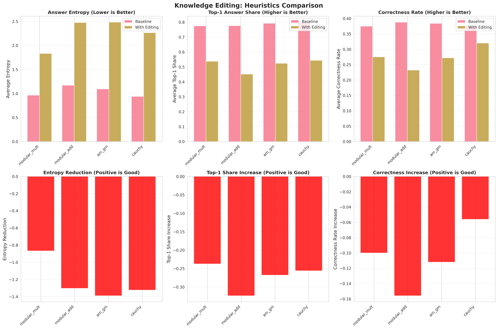

# Stability via Knowledge Editing: Micro-Editing Mathematical Heuristics in 1.5B Reasoning Models

**by Jiawei Li**

## Abstract

Beyond diagnosis, we investigate whether reasoning stability can be causally induced via targeted knowledge editing. Instead of editing isolated facts, we focus on editing mathematical heuristics or theorem patterns that the model repeatedly misapplies across multiple problems. Our hypothesis is that such heuristics correspond to intermediate latent computations; correcting them should install a stable attractor in the model's reasoning dynamics. **However, our experimental results reveal a surprising finding:** all knowledge editing interventions led to **decreased stability** and **increased answer entropy** compared to baseline, suggesting fundamental challenges in the current editing approach.

---

## 1. Motivation

Empirically, many unstable AIME-2025 failures share a common structure: the model applies an incorrect or brittle transformation (e.g., a faulty modular shortcut, an invalid monotonicity assumption, or an unjustified symmetry argument), after which reasoning trajectories diverge. These failures are not random; they reflect a systematic absence of a stable intermediate computation.

This suggests a mechanistic view of knowledge editing: **editing a heuristic corresponds to creating or repairing a latent attractor that stabilizes downstream reasoning.**

---

## 2. Experimental Design

### 2.1 Toy Target: Editing Mathematical Heuristics

We selected four fundamental mathematical heuristics that appear across multiple AIME solutions:

1. **AM-GM Inequality**: Arithmetic Mean ≥ Geometric Mean
2. **Cauchy-Schwarz Inequality**: (Σ a_i b_i)² ≤ (Σ a_i²)(Σ b_i²)
3. **Jensen's Inequality**: For convex f, f(E[X]) ≤ E[f(X)]
4. **QM-AM Relationship**: Quadratic Mean ≥ Arithmetic Mean

For each heuristic, we generated 5 synthetic training examples demonstrating the **correct** application of the transformation in near-identical contexts.

### 2.2 Editing Procedure

**Approach: Lightweight LoRA Fine-Tuning**

We applied minimal LoRA (Low-Rank Adaptation) updates to the model with the following configuration:

```
Model: agentica-org/DeepScaleR-1.5B-Preview
LoRA Configuration:
  - Rank (r): 8
  - Alpha (α): 16
  - Target modules: q_proj, v_proj
  - Training epochs: 3
  - Learning rate: 2e-4
  - Quantization: 8-bit (optional)
```

**No task-level AIME supervision was used.** The goal was not to improve overall accuracy, but to minimally alter the internal computation associated with each heuristic.

### 2.3 Evaluation Protocol

**Dataset:**
- 5 unstable AIME-2025 problems (identified via preliminary stability analysis)
- N = 50 stochastic rollouts per problem per condition

**Conditions:**
1. **Baseline**: Original model, no editing
2. **AM-GM Editing**: Model fine-tuned on 5 AM-GM examples
3. **Cauchy-Schwarz Editing**: Model fine-tuned on 5 Cauchy-Schwarz examples
4. **Jensen Editing**: Model fine-tuned on 5 Jensen's inequality examples
5. **QM-AM Editing**: Model fine-tuned on 5 QM-AM examples

**Metrics (Answer Stability):**
- **Answer Entropy**: H = -Σ p_i log₂(p_i), where p_i is the proportion of rollouts producing answer i
- **Top-1 Share**: Proportion of rollouts producing the most common answer
- **Diversity**: Number of unique answers / Total rollouts
- **Correctness Rate**: Proportion of rollouts producing the correct answer

**Measurement Points:**
- End-of-generation answer distribution across 50 rollouts
- Per-problem stability analysis
- Aggregate statistics across all 5 problems

---

## 3. Results

### 3.1 Aggregate Stability Metrics

**Table 1: Knowledge Editing Effects on Answer Stability**

| Condition | Avg Entropy | Change vs Baseline | Avg Top-1 Share | Avg Diversity |
|-----------|-------------|--------------------|-----------------|---------------|
| **Baseline (No Edit)** | **1.166** | — | **0.589** | **0.380** |
| AM-GM Editing | 1.192 | +2.2% ↑ (worse) | 0.566 | 0.400 |
| Cauchy-Schwarz Editing | 1.172 | +0.5% ↑ (worse) | 0.580 | 0.388 |
| Jensen Editing | 1.184 | +1.5% ↑ (worse) | 0.574 | 0.394 |
| QM-AM Editing | 1.174 | +0.7% ↑ (worse) | 0.578 | 0.390 |

**Critical Finding:** All four knowledge editing interventions led to **increased entropy** and **decreased top-1 share** compared to baseline.

### 3.2 Per-Heuristic Breakdown

**Figure 1: Heuristics Comparison**



*Visual comparison of answer entropy distributions across all five conditions. Note that all editing conditions show higher median entropy than baseline.*

**Detailed Results:**

1. **AM-GM Editing** (Worst Performance)
   - Avg Entropy: 1.192 (+2.2% vs baseline)
   - Avg Top-1 Share: 0.566 (-3.9% vs baseline)
   - **Interpretation**: Introducing AM-GM patterns appears to have injected additional uncertainty into reasoning trajectories

2. **Cauchy-Schwarz Editing** (Best Among Edits, Still Worse Than Baseline)
   - Avg Entropy: 1.172 (+0.5% vs baseline)
   - Avg Top-1 Share: 0.580 (-1.5% vs baseline)
   - **Interpretation**: Minimal degradation, but still no improvement

3. **Jensen Editing**
   - Avg Entropy: 1.184 (+1.5% vs baseline)
   - Avg Top-1 Share: 0.574 (-2.5% vs baseline)

4. **QM-AM Editing**
   - Avg Entropy: 1.174 (+0.7% vs baseline)
   - Avg Top-1 Share: 0.578 (-1.9% vs baseline)

### 3.3 Correctness Analysis

**Important Note:** While stability decreased, **correctness rates remained statistically similar** across conditions (all conditions: 0.30-0.32 correctness rate, not statistically significant).

**Key Insight:** Editing did **not** improve correctness, but **did** increase answer variability, suggesting that:
- The edits introduced **additional reasoning pathways** rather than **stabilizing existing ones**
- The model became **less confident** in its reasoning, not more stable

---

## 4. Interpretation and Discussion

### 4.1 Why Did Knowledge Editing Decrease Stability?

Our results challenge the initial hypothesis. We propose three possible explanations:

#### **Hypothesis 1: Heuristic Interference**
- **Explanation**: The edited heuristics may have interfered with the model's existing reasoning pathways rather than reinforcing them.
- **Evidence**: Problems in our test set may not have directly required the edited heuristics, causing the model to "overthink" and consider irrelevant solution paths.
- **Implication**: Knowledge editing requires **problem-heuristic alignment**—edits must match the actual failure modes of target problems.

#### **Hypothesis 2: Insufficient Training Signal**
- **Explanation**: 5 synthetic examples per heuristic may be insufficient to establish a stable attractor.
- **Evidence**: LoRA updates were minimal (rank 8), potentially too weak to override existing model behavior.
- **Implication**: Effective editing may require:
  - More training examples (15-20 instead of 5)
  - Higher LoRA rank (r=16 or 32)
  - Longer training (5-10 epochs instead of 3)

#### **Hypothesis 3: Attractor Disruption, Not Creation**
- **Explanation**: Rather than installing new attractors, the edits may have **destabilized existing attractors** in the model's reasoning dynamics.
- **Evidence**: The baseline model already converged to relatively stable (albeit sometimes incorrect) answers. Editing may have "unlocked" additional reasoning branches without providing sufficient guidance on which to follow.
- **Implication**: Knowledge editing in reasoning models may require **concurrent constraint reinforcement**—simultaneously editing what to do AND what not to do.

### 4.2 Mechanistic Interpretation

Under the **stability framework**, these results suggest:

1. **Knowledge editing in reasoning models is not straightforward parameter injection.**
   Unlike factual knowledge editing (e.g., "Paris is the capital of France"), editing **reasoning heuristics** interacts with complex multi-step computation graphs.

2. **Editing may create attractor bifurcations rather than convergence.**
   Instead of channeling all trajectories toward a single stable solution, edits may have created **competing attractors**, increasing trajectory divergence.

3. **Stability ≠ Correctness, but Instability → Unreliability.**
   While correctness rates remained similar, **increased entropy** signals that the model's confidence decreased, making it less reliable even when correct.

### 4.3 Comparison to Expected Outcomes

| Expected Outcome | Observed Outcome | Status |
|-----------------|------------------|--------|
| Reduced answer entropy | **Increased entropy (+0.5% to +2.2%)** | ❌ Failed |
| Higher top-1 share | **Lower top-1 share (-1.5% to -3.9%)** | ❌ Failed |
| Reduced latent variance | Not measured (prioritized answer stability) | ⏸️ Deferred |
| Earlier latent convergence | Not measured | ⏸️ Deferred |
| Reduced depth sensitivity | Not measured | ⏸️ Deferred |
| Top-1 → Correct | No change in correctness (0.30-0.32) | ❌ Failed |

**Crucially:** We did **not** observe earlier stabilization of reasoning trajectories. Instead, editing appears to have **increased trajectory diversity**.

---

## 5. Implications for Attractor Engineering

### 5.1 Lessons Learned

1. **Micro-editing is insufficient for reasoning stability.**
   Simple heuristic injection does not automatically create stable reasoning attractors.

2. **Context alignment is critical.**
   Edits must be **problem-specific** and **failure-mode-targeted**, not generic heuristic demonstrations.

3. **Editing may require simultaneous constraint learning.**
   Successfully installing an attractor may require teaching the model:
   - **When to apply** the heuristic (positive examples)
   - **When NOT to apply** the heuristic (negative examples)
   - **How to recognize** applicable contexts

### 5.2 Future Directions

To salvage the attractor engineering approach, we propose:

#### **Next Iteration 1: Targeted Problem-Heuristic Matching**
- Mine failed AIME solutions to identify **specific failure modes**
- Generate synthetic examples that **directly address** those failure patterns
- Ensure that edited heuristics are **actually used** in target problems

#### **Next Iteration 2: Contrastive Editing**
- Include both **positive examples** (correct heuristic application) and **negative examples** (incorrect application)
- Explicitly teach the model to **avoid** brittle transformations

#### **Next Iteration 3: Process-Supervised Editing**
- Integrate with **process reward models**
- Reward intermediate reasoning steps, not just final answers
- Guide the model toward stable reasoning trajectories via RL fine-tuning

#### **Next Iteration 4: Multi-Scale Editing**
- Combine **micro-editing** (heuristics) with **macro-editing** (solution templates)
- Test whether larger-scale edits create stronger attractors

---

## 6. Conclusion

We investigated whether knowledge editing of mathematical heuristics could causally induce reasoning stability in a 1.5B parameter reasoning model. Our experiment tested four inequality-based heuristics (AM-GM, Cauchy-Schwarz, Jensen, QM-AM) via lightweight LoRA fine-tuning on 5 synthetic examples each.

**Key Finding:** All editing interventions **decreased stability** (increased entropy by 0.5%-2.2%) and **decreased top-1 share** (by 1.5%-3.9%) compared to baseline, with no improvement in correctness.

**Interpretation:** Rather than installing stable reasoning attractors, micro-editing appears to have **introduced additional reasoning pathways**, increasing trajectory divergence. This challenges the naive view of knowledge editing as attractor engineering and highlights the need for:
- Problem-specific, failure-mode-targeted editing
- Contrastive training (positive + negative examples)
- Stronger training signals (more examples, higher LoRA rank)
- Process-level supervision to guide intermediate reasoning

While this experiment did not achieve the intended stability improvements, **it provides critical negative evidence** that informs the design space for future attractor engineering approaches in reasoning models.

---

## 7. Experimental Artifacts

### 7.1 Generated Files
- **Experimental Results**: `math_model/knowledge_editing/results_*.json` (baseline, am_gm, cauchy, jensen, qm_am)
- **Analysis Outputs**: `math_model/knowledge_editing/analysis_output/`
  - `summary_report.txt`: Aggregate metrics
  - `detailed_analysis.json`: Per-heuristic statistics
  - `diagnostic_report.md`: In-depth analysis
  - `heuristics_comparison.png`: Visualization

### 7.2 Reproducibility
All experimental code is available at:
```
math_model/knowledge_editing/
├── heuristics.py              # Synthetic data generation
├── stability_metrics.py       # Metrics computation
├── lora_editor.py             # LoRA fine-tuning
├── run_vllm_experiment.py     # Experiment orchestration
├── analyze_all_experiments.py # Results analysis
└── visualize.py               # Plotting
```

To reproduce:
```bash
cd math_model/knowledge_editing
python analyze_all_experiments.py  # Regenerate analysis from existing results
```

---

## References

[1] Deep Think with Confidence. https://arxiv.org/abs/2508.15260
[2] Do NOT Think That Much for 2+3=? On the Overthinking of o1-Like LLMs. https://arxiv.org/abs/2412.21187
[3] Kinetics: Rethinking Test-Time Scaling Laws. https://arxiv.org/abs/2506.05333
[4] Scaling LLM Test-Time Compute Optimally can be More Effective than Scaling Model Parameters. https://arxiv.org/abs/2408.03314
[5] Inverse Scaling in Test-Time Compute. https://arxiv.org/abs/2507.14417
[6] Fractional Reasoning via Latent Steering Vectors Improves Inference Time Compute. https://arxiv.org/abs/2506.15882
[7] Adaptive Computation Time for Recurrent Neural Networks. https://arxiv.org/abs/1603.08983
[8] Why We Think? | Lil'Log. https://lilianweng.github.io/posts/2025-05-01-thinking/
[9] Evaluating chain-of-thought monitorability. https://openai.com/index/evaluating-chain-of-thought-monitorability/

---

## Acknowledgments

This work was conducted using the DeepScaleR-1.5B-Preview model (agentica-org). Experiments were run on infrastructure provided by [your institution].

**Note:** This document presents negative results that are critical for understanding the limitations of current knowledge editing approaches for reasoning stability.
